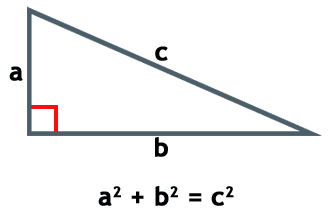

Unidad 1: Ejercicios
--------------------

1. Realice un programa donde se pregunte el nombre y edad de una persona
   y luego se muestre un cordial saludo. Por ejemplo:

::

        Ingrese su nombre: Carlos
        Ingrese su edad: 98
        
        Hola Carlos, 98 años no es nada, estás hecho un pibe!

2- Realice un programa donde se ingrese el nombre y edad de dos personas
en variables separadas (nom1, edad1, nom2, edad2). Luego, intercambie la
edad de las personas y muestre el resultado en pantalla. Posteriormente
indague otras maneras de intercambiar el contenido de variables en
Python.

3- Realice un programa que permita ingresar por teclado dos valores
referidos al kilometraje de un automóvil antes y después de un viaje.
Con los dos valores ingresados muestre en pantalla la cantidad total de
kilómetros recorridos, así como también ese valor convertido a metros y
centímetros.

4- Realice un programa que permita al usuario ingresar una temperatura
en grados centígrados y que muestre su equivalente en grados fahrenheit.
El programa debe mostrar como el siguiente:

::

        Ingrese temperatura en °C: 33.8
        Conversión a Fahrenheit: 92.84

La conversión está dada por la siguiente relación °F = (9/5 * °C) + 32   

5- Realice un programa que permita al usuario ingresar su nombre y que
luego lo muestre repetido en pantalla tantas veces como cantidad de
letras posea el nombre.

6- Un atleta realiza sus entrenamientos para una maratón (42.195km) y
desea conocer su velocidad promedio. Desarrolle un programa donde se
ingrese el tiempo transcurrido en tres variables diferentes: horas,
minutos y segundos. Luego, muestre la velocidad promedio en km/h y
km/seg.

7- Hace unos cuantos años, Don Pitágoras dijo que el cuadrado de la
hipotenusa era igual a la suma de los cuadrados de los catetos.

¿Será cierto esto?. Supongamos que el valor de la hipotenusa (C) es de
29.15 , la del cateto A 25, y la del cateto B es de 15. Realice un
programa que permita validar esto.

8- Modifique el código anterior, para que (ahora que sabe que es
cierto) le pregunte al usuario por los valores de los catetos A y B, y
luego realice el cálculo de la hipotenusa y lo devuelva por pantalla.

9- Un grupo de amigos se reúnen a ver un clásico de fútbol entre el
equipo A y el equipo B, y establecen como regla que los hinchas del
equipo que pierda deberán pagar la totalidad de las cervezas consumidas
durante el partido, como así también el costo de picada consumida en la
previa. En caso de empate los costos se dividen por igual. El siguiente
código refleja esta situación, pero solo contempla 2 de los 3 casos
posibles. Modifíquelo para que también informe cuanto tendría que pagar
cada hincha en caso de un empate:

.. code:: python

    # Datos de entrada
    equipo_a = input('Cantidad de hinchas del equipo A: ')
    equipo_b = input('Cantidad de hinchas del equipo B: ')
    costo_picada = input('Costo de la picada: ')
    costo_cervezas = input('Costo total de las cervezas: ')
    
    # Sumo los costos
    costo_total = float(costo_picada) + float(costo_cervezas)
    
    # Para el caso en que gane el equipo A
    monto_a_pagar = costo_total/int(equipo_b)
    print('Si el equipo B pierde, sus hinchas deben pagar: $', monto_a_pagar)
    
    # Para el caso en que gane el equipo B
    monto_a_pagar = costo_total/int(equipo_a)
    print('Si el equipo A pierde, sus hinchas deben pagar: $', monto_a_pagar)

10- Modifique el código del ejercicio anterior para que haciendo uso del módulo
*statistics* de la biblioteca estándar de python, devuelva el valor promedio que se paga (mean), 
la mediana(median) y varianza (variance).

11- Modifique el código anterior, para que en vez de pedir que se
ingresen los 3 valores por teclado, genere estos de manera aleatoria. El
programa deberá devolver la media, mediana y varianza, junto a los 3
valores que se generaron aleatoriamente.
