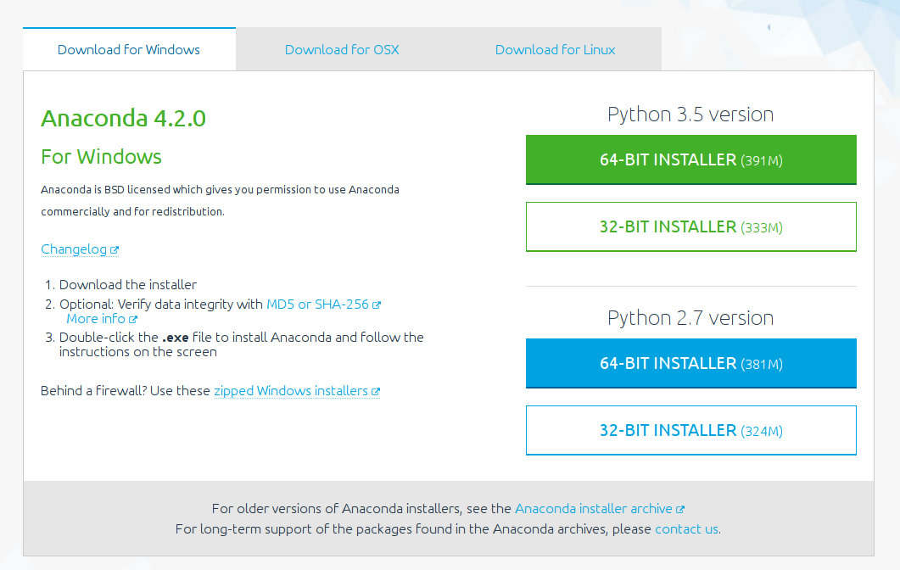
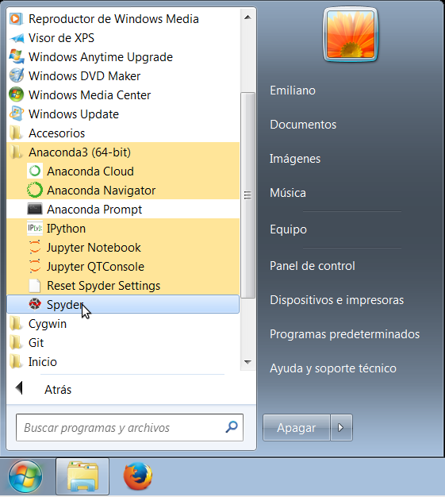
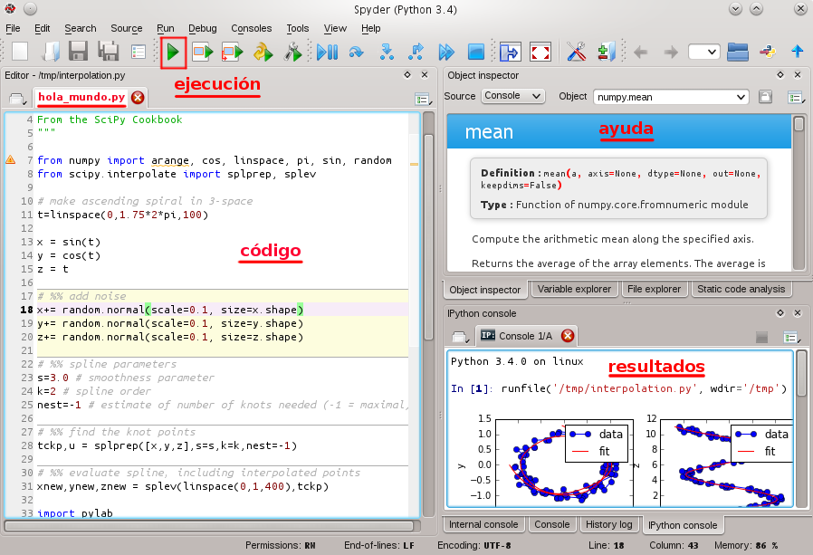

=========================================
Introducción a la Programación con Python
=========================================

:Autor: Emiliano López - elopez@fich.unl.edu.ar
:Fecha: |date| |time| - [`última versión disponible <https://gitlab.com/emilopez/dev01/intro-a-python>`__]

.. raw:: pdf

   PageBreak oneColumn

.. header:: 
  Introducción a la Programación con Python - Unidad I

.. footer::
    ###Page### / ###Total###

.. contents:: Unidad I: Introducción

.. sectnum::

.. raw:: pdf

   PageBreak oneColumn

.. |date| date:: %d/%m/%Y
.. |time| date:: %H:%M

.. raw:: pdf

   PageBreak oneColumn

.. include:: licencia.rst

.. raw:: pdf

   PageBreak oneColumn

Motivación
----------

Gran parte de las tecnologías utilizadas en la actualidad basan su funcionamiento 
en algún tipo de programa. Que una computadora tenga la flexibilidad de ser utilizada 
para jugar, predecir el comportamiento climático o gestionar un sanatorio depende 
exclusivamente de los programas que ejecuta, desde esta perspectiva programar nos 
permite intervenir sobre parte de la realidad desde una postura activa y,
comprender su funcionamiento nos abre un abanico de posibilidades ilimitadas. 

Programar no sólo nos permite crear, sino también resolver problemas
que de otro modo serían imposibles. Procesar miles o millones de datos, 
relacionarlos, analizarlos, graficarlos, etc, pasa de ser una gesta heroica 
-comparable a escalar el Aconcagua descalzo- a escribir unas cuantas líneas de código.

Lo más importante es que todos podemos programar, simplemente 
tenemos que aprender un conjunto de reglas básicas, saber como aplicarlas 
y tener muchas ganas de crear. Además, programar es muy divertido, 
y, al contrario de lo que muchos podrían pensar en un principio, es como un gran 
rompecabezas en el que debemos encajar ciertas piezas de una 
forma específica para conseguir el resultado deseado.

Aprender a programar implica conocer cierta lógica y una determinada sintaxis. 
En este curso haremos énfasis en adquirir el pensamiento lógico utilizando **Python** 
como lenguaje de programación por lo que aprenderemos su sintaxis.

Del mismo modo que un enófilo se convierte en un experto en vinos probándolos, 
a programar se aprende programando y leyendo código. Aquí es donde la sintaxis
se vuelve relevante y puede facilitarnos la vida o definitivamente complicarla.

Esta es la principal razón por la que hemos decidido utilizar Python como primer lenguaje 
de programación, sumado a que existen una gran cantidad de programas 
desarrollados en este lenguaje, desde herramientas para servidores, hasta 
programas para usuarios finales, pasando por aplicaciones empresariales, 
herramientas de desarrollo, plataformas web, juegos de todo tipo, y muchísimas
aplicaciones software libre, disponibles para analizar su código.

¿Cómo se programa?
------------------

En términos generales, programar consiste en dos tareas básicas:

- Escribir en un archivo de texto el código de las instrucciones, denominado **código fuente**. 
- Ejecutar otro programa (en nuestro caso será Python) alimentándolo con el código previo.

Cada una de estas tareas puede hacerse por separado pero en general son realizadas dentro de un entorno que 
integra el proceso de desarrollo de software. Estos entornos se denominan IDE (del inglés Integrated Development Environment)
y facilitan enormemente las tareas comúnmente llevadas a cabo como la depuración de errores, elementos de ayuda, entre otros.

Python es un software que interpreta aquello que programemos y nos arroja su resultado. De aquí en más utilizamos el término
**intérprete** y Python como sinónimos.

¿Por qué Python?
----------------

Python es un lenguaje de programación multipropósito, flexible, poderoso y fácil
de aprender. Es del tipo interpretado, lo que significa que donde se pueda instalar
el intérprete podremos ejecutar nuestros programas.

Python se distribuye como software de código abierto (licencia PSF). 
Su filosofía hace hincapié en una sintaxis que favorezca un código legible. 
Es también multiparadigma, ya que soporta orientación a objetos, programación 
imperativa y programación funcional. 

Es sencillo de aprender, y muchos programadores Python reconocen un sustancial 
aumento en su productividad además de sentir que el lenguaje mismo los 
incentiva al desarrollo de código de mayor calidad. Está disponible 
para múltiples arquitecturas, desde una PC hasta teléfonos celulares, y muchos 
sitios de Internet utilizan Python como soporte de sus servicios.

Es un lenguaje que cuenta con estructuras de datos eficientes y de alto
nivel. Su elegante sintaxis y su tipado dinámico hacen de éste un
lenguaje ideal para el desarrollo rápido de aplicaciones en diversas
áreas como:

-  Aplicaciones WEB
-  Aplicaciones científicas
-  Gráficas
-  Multimedia
-  Juegos
-  Etc.

Otra de las grandes virtudes es que su intérprete puede
ejecutarse en la mayoría de los sistemas operativos utilizados en la
actualidad (GNU/Linux, Microsoft Windows, Mac OSX, etc.).

Dada su versatilidad, simplicidad y su gran potencia, Python es un lenguaje en 
continuo crecimiento por lo que cuenta con un gran apoyo de la comunidad, además 
es utilizado por compañías como Google, Youtube, Netflix, Yahoo, NSA, NASA, Canonical, 
IBM, entre otras tantas.

Desde los últimos años existe un constante crecimiento en el uso de Python como lenguaje
para enseñar programación en las universidades. En el siguiente gráfico se observan
los lenguajes elegidos en los cursos introductorios de universidades extranjeras.

.. figure:: img/u1/Top39-700.4.png
    :width: 1200 px

Instalación
-----------

Python cuenta con dos ramas simultáneas de desarrollo, la 2.x y 3.x. Si bien ambas son completamente 
funcionales, es recomendable utilizar alguna versión de la rama 3.x. La última versión disponible 
del intérprete para cada rama es la 2.7.12 y la 3.5.2.

En el presente curso utilizaremos la versión **3.x** cuya instalación realizaremos a partir del paquete Anaconda.
Anaconda incluye -además del intérprete de Python- varias herramientas que simplifican el proceso de instalación.
Se debe descargar el instalador correspondiente al sistema operativo (Windows, Linux o Mac) y a la 
arquitectura del hardware (64 o 32 bits) del sitio web `www.continuum.io/downloads <https://www.continuum.io/downloads>`__, 
tal como se observa en la siguiente captura.

    
    Descarga del paquete Anaconda que contiene Python

La instalación debe realizarse haciendo sucesivos clicks en el botón *Next*, dejando tildadas las opciones por defecto
hasta que finalice el proceso. Una vez terminada la instalación, en el botón inicio encontrará un menú denominado 
Anaconda con varios programas incluidos, en la siguiente figura se muestra el resultado de una instalación bajo Windows 7.

    
    Menú creado luego de instalar Anaconda

Para el caso de sistemas GNU/Linux, una vez descargado el instalador se debe ejecutar desde la consola el siguiente comando, aceptando todas las opciones por defecto:

.. code:: bash 
    
    bash Anaconda3-4.2.0-Linux-x86_64.sh

Entornos de programación
------------------------

Entorno integrado de desarrollo (IDE)
~~~~~~~~~~~~~~~~~~~~~~~~~~~~~~~~~~~~~

Un IDE es un entorno que nos facilita las tareas a la hora de programar.
Consiste en la integración de un editor de texto con características de
resaltado de sintaxis, auto-completado, inspector del contenido de las variables, 
análisis de sintaxis y, entre otras funcionalidades, el intérprete de
Python. Existen cientos de entornos muy buenos, como por ejemplo
`Spyder <https://github.com/spyder-ide/spyder>`__,
`PyCharm <https://www.jetbrains.com/pycharm>`__ o
`Ninja-IDE <http://ninja-ide.org>`__.  Si bien en el presente curso nos basaremos en **Spyder**, 
el usuario puede optar por aquella IDE que le resulte de su preferencia.

Con la instalación previa de Anaconda, se incluye Spyder. En la siguiente figura se lo observa en funcionamiento, 

.. figure:: img/u1/spyder-ide.png
    :width: 1300 px
    
    IDE Spyder

Una lista bastante completa sobre las IDEs disponibles pueden
encontrarse en la `wiki oficial de
Python <https://wiki.python.org/moin/IntegratedDevelopmentEnvironments>`__

El intérprete interactivo
~~~~~~~~~~~~~~~~~~~~~~~~~

Python permite obtener respuesta de cada instrucción ejecutada de modo interactivo. 
Esta modalidad de uso suele ser útil para corroborar el funcionamiento de ciertas
acciones en forma aislada. 

Para ingresar al modo interactivo, debe ingresarse desde la línea de comandos el comando ``python`` y, 
dependiendo del sistema operativo veremos una salida similar a la siguiente:

.. code:: python

    C:\Users\Emiliano>python
    Python 3.5.2 |Anaconda 4.2.0 (64-bit)| (default, Jul  5 2016, 11:41:13) 
    [MSC v.1 900 64 bit (AMD64)] on win32
    Type "help", "copyright", "credits" or "license" for more information.

Con esto, python esta listo para recibir instrucciones, que en este contexto son llamadas sentencias.
Vamos a comenzar es realizando ciertos cálculos matemáticos sencillos, y corroborando su resultado. 
Por ejemplo, escribamos lo siguiente:

.. code:: python

    >>> 2*5
    10
    >>> 

Como vemos, si ingresamos 2\*5, le estamos diciendo al intérprete 
que debe realizar la multiplicación entre 2 y 5, el proceso consiste en
analizar la instrucción ingresada (2\*5), y contestar con el resultado (10
en este caso).

Hagamos otros cálculos para entrar en calor

.. code:: python

    >>> 2*5+10
    20
    >>> -3*19+3.1415
    -53.8585
    >>> 2/10.0
    0.2
    >>> 

Para salir se debe escribir el comando ``exit()`` o simplemente cerrar la ventana.

IPython, el intérprete interactivo mejorado
~~~~~~~~~~~~~~~~~~~~~~~~~~~~~~~~~~~~~~~~~~~

`IPython <http://ipython.org>`__ es una interfaz mejorada del intérprete
nativo, incluida en Anaconda.

La ejecución de ipython también se realiza desde una terminal, que dependiendo del 
sistema operativo nos arroja una pantalla similar a la siguiente:

.. code:: python

    C:\Users\Emiliano>ipython
    Python 3.5.2 |Anaconda 4.2.0 (64-bit)| (default, Jul  5 2016, 11:41:13) 
    [MSC v.1 900 64 bit (AMD64)]
    Type "copyright", "credits" or "license" for more information.

    IPython 5.1.0 -- An enhanced Interactive Python.
    ?         -> Introduction and overview of IPython's features.
    %quickref -> Quick reference.
    help      -> Python's own help system.
    object?   -> Details about 'object', use 'object??' for extra details.
    In [1]: 

Del mismo modo que el intérprete nativo es posible ingresar sentencias para ser ejecutadas.

Otra alternativa muy interesante son los notebooks de ipython, una interfaz que permite 
programar utilizando el navegador web como entorno. Si bien no entraremos en detalles 
sobre su uso, para lanzar la aplicación se debe ejecutar desde una consola el 
comando ``ipython notebook``, lo que abrirá el navegador web por defecto con el entorno cargado.

Algoritmos computacionales
--------------------------

En forma simplificada, un programa o software es un conjunto de
instrucciones que la computadora -intérprete mediante- puede ejecutar. 
Estas instrucciones es lo que denominamos algoritmo computacional caracterizado por
ser finito, general y preciso. Una analogía comúnmente utilizada sobre un algoritmo 
computacional, es decir un programa, es una receta de cocina, por ejemplo:

::

    Prender el fuego
    Salar la carne
    Controlar cada 5 minutos hasta haya brasas
    Poner la carne a la parrilla
    Cocinar hasta que esté la carne, controlar cada 5 minutos
    Dar vuelta la carne
    Cocinar hasta que esté la carne, controlar cada 5 minutos
    Si falta sal al probar, salar

En esta receta se ven una serie de instrucciones que deben ser seguidas
en un determinado orden, en algunos casos contamos con ingredientes,
instrucciones, decisiones y acciones que se repiten. No muy distinto a un
programa de computación, comencemos con algunos *ingredientes* simples
de Python y veamos lo que podemos hacer con ellos.

El primer programa
~~~~~~~~~~~~~~~~~~

El acercamiento inicial a un lenguaje de programación suele ser con el
popular programa "Hola mundo", que consiste en un
programa que muestra en pantalla ese mensaje.

Renunciando a cualquier pretensión de originalidad comenzaremos del
mismo modo, pero despidiéndonos. Para esto utilizaremos la instrucción
*print()* escribiendo entre los paréntesis el mensaje de despedida entre comillas.

.. code:: python

    print("Adiós mundo cruel!")

Podemos probar la instrucción directamente desde el intérprete, creando
con un editor de texto plano un archivo guardado como ``chau.py`` y
luego ejecutándolo desde la terminal haciendo ``python chau.py``, o
bien utilizando un IDE y haciendo todo desde ahí mismo.

Ahora bien, es muchísimo más lo que podemos hacer programando además de
saludar cordialmente. Veamos los elementos de un programa que nos
permitirán realizar tareas más complejas y entretenidas.

Modos de ejecutar tus programas
-------------------------------

El intérprete interactivo de Python es una gran ayuda para realizar
pruebas y experimentar en tiempo real sobre el lenguaje. Sin embargo,
cuando cerramos el intérprete perdemos lo escrito, por lo que no es una
solución para escribir programas largos y complejos.
Entonces, para un programa guardado con el nombre
*hola\_mundo.py*, lo podemos ejecutar de las siguientes maneras:

Desde la línea de comandos
~~~~~~~~~~~~~~~~~~~~~~~~~~

Abriendo una terminal, e invocando al intérprete python y luego la ruta
y nombre del archivo:

.. code:: bash

    python hola_mundo.py

Desde el IDE
~~~~~~~~~~~~

La mayoría de los IDE cuentan con un botón específico que realiza la ejecución del programa.
En la siguiente figura se observan los componentes de *spyder3*, donde se observa el botón 
correspondiente para lanzar la ejecución, el panel donde se observan los resultados, 
la sección principal donde se escribe el código y una sección de ayuda.

    
    IDE spyder3: botón de ejecución, sección del código, ayuda y resultados.

Elementos de un programa
------------------------

A continuación veremos los elementos fundamentales de un lenguaje de
programación como Python, para llevar a cabo los ejemplos utilizaremos
el intérprete interactivo mejorado ipython.

Números y expresiones
~~~~~~~~~~~~~~~~~~~~~

Frecuentemente requerimos resolver cálculos matemáticos, las operaciones
aritméticas básicas son:

-  adición: +
-  sustracción: -
-  multiplicación: \*
-  división: /
-  módulo: %
-  potencia: \*\*
-  división entera: //

Las operaciones se pueden agrupar con paréntesis y tienen precedencia
estándar. Veamos unos ejemplos.

.. code:: python

    In [9]: 1/3
    Out[9]: 0.3333333333333333

    In [10]: 1//3
    Out[10]: 0

    In [11]: 10%3
    Out[11]: 1

    In [12]: 4%2
    Out[12]: 0

El caso de la potencia, también nos sirve para calcular raíces. Veamos
una potencia al cubo y luego una raíz cuadrada, equivalente a una
potencia a la 1/2.

.. code:: python

    In [13]: 5**3
    Out[13]: 125

    In [14]: 2**(1/2)
    Out[14]: 1.4142135623730951

Los datos numéricos obtenidos en las operaciones previas se clasifican
en reales y enteros, en python se los clasifica ``float`` e ``int``
respectivamente, además existe el tipo ``complex``, para números complejos.

Utilizando la función ``type()`` podemos identificar el tipo de dato.
Veamos:

.. code:: python

    In [15]: type(0.333)
    Out[15]: float

    In [16]: type(4)
    Out[16]: int

Cadenas de caracteres
~~~~~~~~~~~~~~~~~~~~~

Además de números, es posible manipular texto. Las cadenas son
secuencias de caracteres encerradas en comillas simples ('...') o dobles
("..."), el tipo de datos es denominado ``str`` (string). Sin adentrarnos
en detalles que posteriormente veremos, aquí trataremos lo
indispensable para poder desarrollar los primeros programas. Veamos unos
ejemplos usando el intérprete interactivo python:

.. code:: python

    >>> 'de la papa al puré'         # comillas simples
    'de la papa al puré'

Los operadores algebraicos para la suma y multiplicación tienen efecto
sobre las cadenas:

.. code:: python

    >>> 'eco '*4               # La multiplicación repite la cadena
    'eco eco eco eco '

    >>>'yo y '+ 'mi alter ego'   # La suma concatena dos o mas cadenas
    'yo y mi alter ego'

Es posible utilizar cadenas de más de una línea, usando **tres
comillas** simples o dobles al inicio y al final, por ejemplo (fragmento
del poema de Fortunato Ramos *Yo jamás fui un niño*):

.. code:: python

    '''
    Mi sonrisa es seca y mi rostro es serio,
    mis espaldas anchas, mis músculos duros
    mis manos partidas por el crudo frío
    sólo ocho años tengo, pero no soy un niño.
    '''

Comentarios en el código
~~~~~~~~~~~~~~~~~~~~~~~~

En los ejemplos previos y siguientes, veremos dentro del código
comentarios explicativos que no serán ejecutados por el intérprete. Su
uso solamente está destinado a quien lea el código, como texto
explicativo para orientar sobre lo que se realiza.

Los comentarios pueden ser de una única o múltiples líneas. Para el
primer caso se utiliza el símbolo numeral. Lo que continúa a la derecha
de su uso no es ejecutado.

Los comentarios de múltiples líneas se deben escribir entre triples
comillas, ya sean simples o dobles.

Variables
~~~~~~~~~

Las variables vinculan datos con etiquetas, por ejemplo, en la sentencia ``a = 8``, estamos 
asociando al valor ``8`` una etiqueta ``a``, de manera que podemos referirnos a lo largo del 
programa con ``a``, sin importar a qué valor hace referencia. 

Una analogía muy utilizada en la bibliografía (aunque no muy correcta en Python) es la de 
asimilar una variable a una caja contenedora. Para el ejemplo del párrafo previo, el identificador
``a`` es la caja y el valor numérico es lo que contiene.

Por ejemplo, para elevar un número al cubo podemos utilizar 3 variables, para la base
(*num1*), para el exponente (*num2*) y para almacenar el *resultado*:

.. code:: python

    num1 = 5                   # num1 referencia el valor 5.
    num2 = 3                   # num2 referencia al 3.    
    resultado = num1**num2     # resultado toma num1 elevado a num2. 
    print('El resultado es', resultado)

El operador igual (=) es quien realiza esta asociación entre lo que está a su derecha 
con la variable que se encuentra a su izquierda. 

Implementemos la siguiente ecuación para dos valores de *x*, 0.1 y 0.2.

.. math:: y = (x-4)^2-3

.. code:: python

    x = 0.1                              
    y = (x-4)**2-3
    print(x,y)

    x = 0.2                              
    y = (x-4)**2-3

    print(x,y)

Veremos la siguiente salida por pantalla:

::

    0.1 12.209999999999999
    0.2 11.44

Otros ejemplos utilizando variables que referencien **cadenas de caracteres**:

.. code:: python

    cadena1 = 'siento que '
    cadena2 = 'nací en el viento '

    cadena3 = cadena1 + cadena2

    print(cadena3)

Los nombres de las variables (identificador) pueden estar
formados por letras, dígitos y guiones bajos, teniendo en cuenta ciertas
restricciones, no pueden comenzar con un número y ni ser algunas de las
siguientes palabras reservadas:

::

    False      class      finally    is         return
    None       continue   for        lambda     try
    True       def        from       nonlocal   while
    and        del        global     not        with
    as         elif       if         or         yield
    assert     else       import     pass
    break      except     in         raise

Se debe tener en cuenta que las variables diferencian entre mayúsculas y
minúsculas, de modo que juana, JUANA, JuAnA, JUANa son variables
diferentes. Esta característica suele denominarse como *case-sensitive*.

Lectura de datos
~~~~~~~~~~~~~~~~

De los ejemplos que vimos, los valores que almacenan las variables
fueron ingresados en el mismo código, difícilmente sea útil contar con
los valores cargados en el programa en forma estática. Por esta razón,
generalmente se requiere leer información de diferentes fuentes, puede
ser desde un archivo o bien interactuando con un usuario.

La lectura de datos desde el teclado se realiza utilizando la sentencia
*input()* del siguiente modo:

.. code:: python

    nombre = input("¿Cómo es su nombre, maestro? ")
    print("Hola, " + nombre + "!")

El comportamiento es:

::

    ¿Cómo es su nombre, maestro?
    Juan de los palotes
    Hola, Juan de los palotes!

Es importante tener en cuenta que toda lectura por teclado utilizando la
función *input()* va a almacenar lo ingresado como una variable de tipo
*str*, es decir una cadena de caracteres. Veamos el comportamiento al
sumar dos números:

.. code:: python

    num1 = input("Ingrese un número = ")
    num2 = input("Ingrese otro número = ")
    print("El resultado es =", num1+num2)

.. parsed-literal::

    Ingrese un número = 28
    Ingrese otro número = 03
    El resultado es = 2803

Claramente la suma de los valores ingresados no da el resultado
observado. El inconveniente se debe a que ambos valores son tomados como
cadenas de caracteres y la operación de suma entre cadenas
produce su la concatenación. Es necesaria convertir la cadena
de caracteres (str) a un valor numérico, ya sea entero o real (int o
float).

Para convertir datos de diferentes tipo se utilizan las funciones ``int()``,
``float()`` o ``str()``. Entonces, modificando el caso anterior:

.. code:: python

    num1 = int(input("Ingrese un número = "))
    num2 = int(input("Ingrese otro número = "))
    print("El resultado es =", num1+num2)

.. parsed-literal::

    Ingrese un número = 28
    Ingrese otro número = 03
    El resultado es = 31

Veamos un ejemplo para operar directamente el valor leído en una
ecuación matemática con el siguiente código:

.. code:: python

    x = input("Ingrese x = ") 
    y = (x-4)**2-3
    print(x,y)

.. parsed-literal::

    Ingrese x = 3

::

    ----------------------------------------------------------------------

    TypeError                            Traceback (most recent call last)

    <ipython-input-3-3baa5c95d16e> in <module>()
          1 x = input("Ingrese x = ")
    ----> 2 y = (x-4)**2-3
          3 print(x,y)

    TypeError: unsupported operand type(s) for -: 'str' and 'int'

A diferencia del ejemplo visto anteriormente, donde la suma de dos
cadenas era una operación perfectamente válida, ahora nos encontramos
con operaciones entre diferentes tipos pero **incompatibles**. En este caso,
podemos convertir la entrada en un número flotante para operar con
normalidad:

.. code:: python

    x = float(input("Ingrese x = "))
    y = (x-4)**2-3
    print(x,y)

.. parsed-literal::

    Ingrese x = 3
    3.0 -2.0

Es posible combinar distintos tipos de datos haciendo la conversión
correspondiente. En el último ejemplo, tanto *x* como *y* son de tipo
*float* y es posible concatenarlos a una cadena de caracteres haciendo
la conversión correspondiente con la función *str()*:

.. code:: python

    mensaje = 'y vale ' + str(y) + ' para un valor de x = '+ str(x)

Escritura de datos
~~~~~~~~~~~~~~~~~~

Hemos hecho uso de la función *print()* en su mínima expresión. Iremos
viendo diferentes usos a partir de las siguientes variables:

.. code:: python

    # Variables a imprimir
    cad = 'Pi es'
    pi = 3.1415
    mil = 1000
    uno = 1

Como argumentos
^^^^^^^^^^^^^^^

La forma más simple es separar los argumentos a ser impresos mediante
comas.

.. code:: python

    print(cad, pi, 'aproximadamente')

.. parsed-literal::

    Pi es 3.1415 aproximadamente

Por defecto, la separación que se obtiene entre cada argumento es un
espacio en blanco, sin embargo, se puede cambiar este comportamiento
agregando como argumento ``sep=' '`` y entre las comillas incluir el
separador deseado, por ejemplo:

.. code:: python

    print(cad, pi,'aproximadamente', sep=';')
    print(cad, pi,'aproximadamente', sep=',')
    print(cad, pi,'aproximadamente', sep=':-)')

.. parsed-literal::

    Pi es;3.1415;aproximadamente
    Pi es,3.1415,aproximadamente
    Pi es:-)3.1415:-)aproximadamente

Como vemos, en cada ejecución la impresión se realiza en diferentes
renglones, este es el comportamiento por defecto, que puede ser
modificando agregando el parámetro ``end=" "``. Reflejemos esto con un
ejemplo:

.. code:: python

    print(1, end=" ")
    print(2, end=" ")
    print(3)
    print(4)

.. parsed-literal::

    1 2 3
    4

Usando comodines
^^^^^^^^^^^^^^^^

Los comodines consisten en una marca especial en la cadena a imprimir
que es reemplazada por la variable y el formato que se le indique.
Existen tres tipos de comodines, para números enteros, reales
(flotantes) y para cadenas de caracteres:

-  Comodín para reales: %f
-  Comodín para enteros: %d
-  Comodín para cadenas: %s

Se utilizan del siguiente modo:

.. code:: python

    print('Pi es %f aproximadamente' %pi)   
    print('El número %d es %s que %d' %(mil,"menor",mil-1))

.. parsed-literal::

    Pi es 3.141500 aproximadamente
    El número 1000 es menor que 999

Es posible formatear los valores, elegir el ancho del campo, la cantidad
de decimales, entre muchas otras funciones.

.. code:: python

    print('%.2f %.4f %.3f' %(pi,pi,pi))
    print('%4d' %uno)

La sintaxis general del uso de comodines es:

::

    %[opciones][ancho][.precisión]tipo 

Algunas variantes de lo visto se explica en la siguiente lista:

-  %d : un entero
-  %5d: un entero escrito en un campo de 5 caracteres, alineado a la
   derecha
-  %-5d: un entero escrito en un campo de 5 caracteres, alineado a la
   izquierda
-  %05d: un entero escrito en un campo de 5 caracteres, completado con
   ceros desde la izquierda (ej. 00041)
-  %e: flotante escrito en notación científica
-  %E: como %e, pero E en mayúscula
-  %11.3e: flotante escrito en notación científica con 3 decimales en un
   campo de 11 caracteres
-  %.3e: flotante escrito en notación científica con 3 decimales en un
   campo de ancho mínimo
-  %5.1f: flotante con un decimal en un campo de 5 de caracteres
-  %.3f: flotante con 3 decimales en un campo de mínimo ancho
-  %s: una cadena
-  %-20s: una cadena alineada a la izquierda en un campo de 20
   caracteres de ancho

Con lo visto hasta aquí tenemos suficientes alternativas para mostrar en
pantalla información de diferentes tipos. Existen una alternativa para
imprimir en pantalla utilizando el método ``format``, el lector interesado
puede indagar más al respecto en el capítulo
`Entrada y Salida <http://docs.python.org.ar/tutorial/3/inputoutput.html>`__ del `tutorial de Python oficial <http://docs.python.org.ar/tutorial/pdfs/TutorialPython3.pdf>`__ o también en el `curso online <http://www.python-course.eu/python3_formatted_output.php>`__ de Python3.

Funciones
~~~~~~~~~

Las funciones son programas o subprogramas que realizan una determinada
acción y que pueden ser invocados desde otro programa. En los capítulos
posteriores trabajaremos en mayor profundidad, en esta sección
presentaremos algunas de las muchas que nos provee Python en su biblioteca
estándar.

El uso de funciones nativas en Python es directo, veamos algunas:

.. code:: python

    frase = 'simple es mejor que complejo'
    num_letras = len(frase)
    print(num_letras)

.. parsed-literal::

    28

El ejemplo previo hicimos uso de dos funciones, por un lado la función
``print()``, presentada ya desde el primer programa y una nueva
función, ``len()``, que recibe como dato de entrada una cadena de
caracteres y calcula la cantidad de caracteres de la misma y lo retorna
de manera tal que lo podemos asignar a una variable (num\_letras).

Módulos
~~~~~~~

Python posee cientos de funciones que se organizan o agrupan en módulos.
Veamos un ejemplo para calcular la raíz cuadrada, el seno y coseno de un
número haciendo uso de las funciones ``sqrt()``, ``sin()`` y ``cos()``, todas
ubicadas bajo el módulo ``math``.

.. code:: python

    import math
    
    nro = 2
    raiz = math.sqrt(nro)
    print("La raíz de %d es %.4f" %(nro,raiz))
    print("El seno de %d es %.4f" %(nro,math.sin(nro)))
    print("El coseno de %d es %.4f" %(nro,math.cos(nro)))

.. parsed-literal::

    La raíz de 2 es 1.4142
    El seno de 2 es 0.9093
    El coseno de 2 es -0.4161

Del ejemplo previo, hemos visto como indicarle a Python que importe -o
haga uso de- un módulo en particular y de algunas de sus funciones
incluidas. También es posible importar funciones específicas de un módulo, 
en el siguiente ejemplo importamos únicamente la función ``sqrt`` y ``sin`` del módulo ``math``, 

.. code:: python

    from math import sqrt, sin
    nro = 2
    raiz = sqrt(nro)
    print("La raíz de %d es %.4f" %(nro,raiz))
    print("El seno de %d es %.4f" %(nro,sin(nro)))

Observamos que de este modo no hace falta reescribir el módulo para invocar a las funciones.
En capítulos posteriores veremos en profundidad distintos modos de importar módulos e invocar sus funciones.

