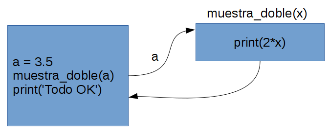
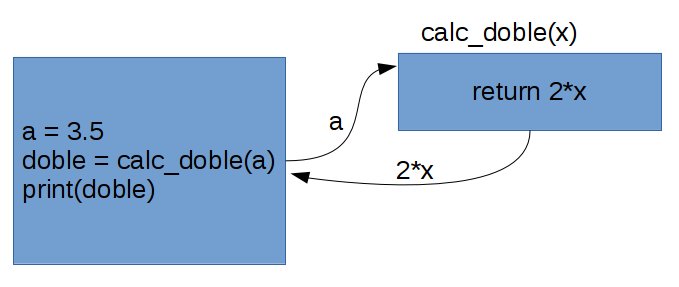

=========================================
Introducción a la Programación con Python
=========================================

:Autor: Emiliano López - elopez@fich.unl.edu.ar
:Fecha: |date| |time| - [`última versión disponible <https://gitlab.com/emilopez/dev01/intro-a-python>`__]

.. header:: 
  Introducción a la Programación con Python - Unidad IV

.. footer::
    ###Page### / ###Total###

.. contents:: Unidad IV: Funciones y archivos

.. sectnum::

.. raw:: pdf

   PageBreak oneColumn

.. |date| date:: %d/%m/%Y
.. |time| date:: %H:%M

.. raw:: pdf

   PageBreak oneColumn

.. include:: licencia.rst

.. raw:: pdf

   PageBreak oneColumn

Unidad 4: Funciones y archivos
==============================

Funciones
---------

Las funciones son subprogramas que realizan una tarea específica, 
capaces de recibir y retornar información (datos de
entrada y salida) desde donde fueron son invocadas.

Cuando una función es invocada, el programa principal transfiere el
control a la función hasta que finalice su ejecución, volviendo luego al
punto desde donde fue llamada.

En los programas desarrollados anteriormente hicimos uso de la función
``len()``, cuyo valor de retorno es un valor numérico entero
que representa la cantidad de elementos de la secuencia que recibió como entrada. 
``len()`` es una de las tantas funciones predefinidas en la
biblioteca estándar de Python. En la presente sección veremos la manera de definir
nuestras propias funciones.

El uso de funciones en el desarrollo de programas tiene un conjunto de
ventajas dentro de las que se destacan:

-  Subdividir un problema complejo en problemas mas simples: divide y
   vencerás.
-  Mejoran la legibilidad del código, los programas modulares son más
   fáciles de entender y mantener.
-  Posibilitan la reusabilidad del código, llamar funciones desde
   distintos programas.

Definición y uso
~~~~~~~~~~~~~~~~

Una función se define anteponiendo la palabra clave ``def`` seguida del
nombre de la función, paréntesis de apertura y cierra y los dos puntos
(:). Luego, el bloque de acciones que la conforman. Veamos la
estructura:

.. code:: python

    def nombre_funcion(argumento1, argumento2, ..., argumentoN):
        accion1
        accion2
        ...
        accionN

En el caso previo la función recibe como entrada argumentos y realiza
una serie de acciones. Las funciones pueden ser definidas en el mismo
programa, con la finalidad de organizar mejor el código. Veamos un
ejemplo de un programa que define y utiliza una función denominada
``muestra_doble()``.

.. code:: python

    # Definición de la función
    def muestra_doble(x):
        '''Imprime en pantalla el doble de x'''
        print(2*x)
     
    # Programa principal
    a = 3.5
    # invoca a la funcion
    muestra_doble(a)
    print('Todo OK')

.. parsed-literal::

    7.0
    Todo OK

Analicemos en detalle la secuencia de ejecución:

-  Desde el programa principal se invoca a la función enviando la
   variable ``a`` como parámetro
-  La función recibe la entrada haciendo una copia de ``a`` en la
   variable ``x``. No importa el identificador de la variable en el
   programa principal, en la función siempre ingresará almacenado
   en ``x``.
-  La función ejecuta sus acciones hasta finalizar 
   y vuelve el control al programa principal
-  El programa principal continúa la ejecución hasta finalizar

Como vemos, no hubo intercambio de información entre el programa principal
y la función, sino que el flujo de datos fue unidireccional, 
se enviaron datos desde el programa principal hacia la función.

Modifiquemos la función de manera que en vez de imprimir en pantalla desde la función, 
lo retorne al programa principal.

.. code:: python

    # Definición de la función
    def calc_doble(x):
        """Retorna el doble de x"""
        return 2*x
     
    # Programa principal
    a = 3.5
    # invoca a la funcion
    doble = calc_doble(a)
    print(doble)

.. parsed-literal::

    7.0

Al igual que en el ejemplo anterior, la función es invocada desde el
programa principal con el parámetro ``a`` y es copiado automáticamente
como ``x`` dentro de la función. Destaquemos las diferencias:

-  El programa principal invoca la función desde una asignación
   (``doble = calc_doble(a)``)
-  Antes de realizarse la asignación, la ejecución pasa el control a la
   función.
-  La función realiza las acciones programadas y al ejecutar la palabra
   reservada ``return`` asigna la operación a su nombre y vuelve el
   control al programa principal
-  El nombre de la función contiene el resultado y es asignado a la
   variable ``doble``
-  Finaliza el programa

Si bien parece trivial, es importante que el nombre de la función sea
acorde a las acciones que realiza e identifique su comportamiento, por
este motivo la función fue renombrada a ``calc_doble``.

El retorno de valores de una función es completamente flexible, se
pueden retornar más de una variable, listas, tuplas, diccionarios o
cualquier combinación de ellas. Veamos un caso de una función que recibe
dos listas de nombres y teléfonos y retorna una agenda en una estructura
de diccionario, donde la primer lista conforma las claves y la segunda
los valores.

.. code:: python

    def arma_agenda(lista_nom, lista_tel):
        """recibe 2 listas y retorna un diccionario"""
        d = {}
        for nom, tel in zip(lista_nom, lista_tel):
            d[nom] = tel
        return d
    
    # Programa principal
    n = ['Kliksberg', 'Stiglitz', 'Zaffaroni', 'Galeano']
    t = ['23444', '54556', '66554', '12121']
    agenda = arma_agenda(n, t)
    print(agenda)

.. parsed-literal::

    {'Kliksberg': '23444', 'Stiglitz': '54556', 'Zaffaroni': '66554', 
    'Galeano': '12121'}

El lector atento habrá notado que en todas las funciones debajo de su
definición existe un texto encerrado entre triples comillas -simples o dobles- 
(como por ejemplo ``"""Retorna el doble de x"""``). 

Este texto funciona como un comentario que se utiliza para documentar brevemente lo
que realiza dicha función. Su uso es opcional, pero es muy recomendable,
dado que puede ser de mucha utilidad para describir el modo de funcionamiento de la función.

Variables globales y locales
~~~~~~~~~~~~~~~~~~~~~~~~~~~~

Hemos visto que las funciones son capaces de recibir uno o varios valores a través de
sus parámetros como así también retornar al programa principal información almacenada
en su nombre.

En cualquiera de estos casos, los valores recibidos no fueron modificados dentro de la función.
La pregunta que surge es: ¿Podemos cambiarlos? ¿Qué sucede si los modificamos?

Veamos un ejemplo y analicemos su comportamiento:

.. code:: python

    def no_cambiemos(nombre):
        nombre = 'Luis Alberto Spinetta'
    
    nom = 'Norberto Napolitano'
    no_cambiemos(nom)
    print(nom)

.. parsed-literal::

    Norberto Napolitano

La variable ``nom`` ingresa a la función como ``nombre`` y si bien se realiza una asignación dentro de la función, vemos que no fue alterado su contenido o al menos no se ve reflejado desde el programa principal. 

Esto sucede debido a que el contenido de la variable ``nom`` es copiada en la variable ``nombre`` y todo cambio que se realice en el interior de la función ``no_cambiemos`` será local, es decir, su ámbito de validez se limita a la función, de manera tal que tanto ``Spinetta`` como ``Napolitano`` son irreemplazables.

Contrariamente al ejemplo previo, existen estructuras de datos que al ser modificadas dentro la función reflejan este cambio también en el programa principal. 

La única condición para que sea posible este comportamiento es que la estructura a ser modificada sea *mutable*, tal es el caso de los diccionarios y listas.

Veamos un caso donde definimos una función que recibe dos argumentos, una lista y una cadena de caracteres, de tipo *mutable* e *inmutable* respectivamente.

.. code:: python

    def modifica(musico, listam):
        listam.append(musico)
    
    artistas = []
    
    modifica('Luis Alberto Spinetta', artistas)
    modifica('Chango Spasiuk',artistas)
    modifica('Norberto Napolitano',artistas)
    modifica('Charly García',artistas)
    
    print(artistas)

.. parsed-literal::

    ['Luis Alberto Spinetta', 'Chango Spasiuk', 'Norberto Napolitano', 
    'Charly García']

El primer argumento, ``musico``, es una cadena de caracteres que
contiene el nombre de un artista y, ``listam`` es una lista donde 
se agrega el músico.

El ejemplo es equivalente al anterior, la
diferencia radica en que el argumento que es modificado en la
función es la misma lista del programa principal, no una copia,
independientemente que se utilice un identificador diferente.

Ahora bien, existen casos donde es necesario modificar una variable del
programa principal desde una función sin que sea recibida a través de
sus argumentos. Para realizar este tipo de acciones necesitamos utilizar
variables cuyo ámbito de validez sea tanto el programa principal como la
función, es decir, variables globales.

Veamos un ejemplo de una función que incrementa una variable global
cuando el número que recibe por argumentos es par:

.. code:: python

    def contar_pares(num):
        global pares
        if num % 2 == 0:
            pares = pares + 1
    
    pares = 0
    
    contar_pares(2)
    contar_pares(5)
    contar_pares(8)
    
    print(pares)

.. parsed-literal::

    2

Algunos detalles a destacar sobre variables globales:

-  Se debe anteponer a la variable la palabra reservada ``global``
-  Toda modificación repercutirá en el estado de la variable del programa principal

El uso de variables globales es una práctica que generalmente debe ser evitada. En la mayoría de los casos es preferible utilizar un parámetro y que la función retorne en su nombre el valor modificado.

Agrupando el código en módulos
~~~~~~~~~~~~~~~~~~~~~~~~~~~~~~

Hemos visto como organizar mejor el código a través de funciones, sin
embargo, una de las ventajas de utilizar funciones propias es evitar su
reescritura. Carece de sentido tener que reprogramar una misma función
por cada programa sumado a que con el paso del tiempo es muy
probable que no todas las versiones sean idénticas y por ende su
comportamiento puede diferir.

Para solucionar este tipo de problemas y sacar provecho del uso de
funciones existen los módulos, cuya utilidad es la de contener varias
funciones que realicen algún tipo de tarea afín.

Por ejemplo, una serie de funciones para cálculo matemático sería útil que estén contenidas en un mismo módulo, en otro aquellas para procesamiento de sonido, o bien uno destinado a almacenar todas las funciones relativas a un determinado proyecto.

Para comprender la implementación veamos un módulo trivial, que contenga saludos en diferentes idiomas. Almacenamos en el archivo ``saludo.py`` las siguientes funciones:

.. code:: python

    def espanol(nom):
        print('Hola', nom)

    def quechua(nom):
        print('Napaykullayki', nom)
        
    def italiano(nom):
        print('Ciao', nom)

    def guarani(nom):
        '''Buen dia, cómo estas?'''
        print("Mba'éichapa ndepyhareve", nom)

    def aymara(nom):
        '''¿cómo estás?'''
        print('Kamisaraki', nom)
        
    def maya(nom):
        '''¿cómo estás?'''
        print('Biix yanilech?', nom)

Luego, creamos el programa desde donde será importado el módulo e
invocadas las funciones que contiene. Por ejemplo, en ``charlando.py``
hacemos lo siguiente:

.. code:: python

    import saludo

    nom = input('Ingrese su nombre: ')
    saludo.italiano(nom)
    saludo.guarani(nom)

Como observamos, el módulo es importado a través del nombre del archivo (sin la extensión *.py*) y luego se invocan las funciones utilizando el nombre del módulo y la función separados por un punto (.), esto es,  ``modulo.funcion``.

De esta manera, fácilmente accedemos a las funciones definidas bajo el módulo. Para el caso que se utilice únicamente una función es posible especificarlo en la cláusula ``import`` del siguiente modo: ``from moduloX import funcionA, funcionB``, cuyo significado es *del módulo X importar la función A y B*. Apliquemos esto al ejemplo previo:

.. code:: python

    from saludo import italiano, guarani

    n = input('Ingrese su nombre: ')
    italiano(n)
    guarani(n)

De esta manera, es posible invocar solamente las funciones importadas. Para profundizar sobre el uso de módulos se recomienda la lectura del capítulo *Módulos* (pag. 36) del Tutorial de Python.

.. raw:: pdf

   PageBreak oneColumn

Archivos
--------

Hasta aquí hemos trabajado con información almacenada en estructuras de datos, ya sea a partir de la lectura interactiva (utilizando la función ``input``) o cargada estáticamente en el mismo código del programa y la salida ha sido siempre a través de la impresión en pantalla (utilizando la función ``print``).

La limitación de este modo de trabajo es que la información no se almacena de modo persistente. Para resolver este inconveniente veremos en la presente sección la manera de utilizar información de entrada y salida para nuestros programas a través de archivos de texto.

Incorporar el uso de archivos a un programa generalmente requiere las siguientes acciones:

-  Abrir el archivo: la apertura de un archivo se realiza a partir de la primitiva ``open`` y consiste en asociar un elemento del programa con un archivo en particular.
-  Elegir el modo de apertura: un archivo puede abrirse para lectura (r), escritura (w), agregado (a), binario (b), lectura/escritura (+)
-  Leer ó escribir en el archivo
-  Cerrar el archivo

Trabajemos con un archivo de texto, por ejemplo ``archi01.txt``, con el siguiente contenido:

::

    enero 30
    febrero 60
    marzo 55

Lectura
~~~~~~~

Vamos a realizar la lectura de este archivo e imprimir por pantalla su
contenido. Dos de los métodos más comunes son:

-  ``readline()``: lee de a una línea por vez cada vez que es invocada
-  ``readlines()``: lee todo el contenido del archivo y lo retorna en una lista

Veamos como sería el funcionamiento del primer caso:

.. code:: python

    # Apertura del archivo en modo lectura
    f = open('ejemplos/u4/archi01.txt', 'r')
    
    # Lee la primer línea
    r = f.readline()
    print(r)
    
    # Lee la segunda línea
    r = f.readline()
    print(r)
    
    # Cierra el archivo
    f.close()

.. parsed-literal::

    enero 30
    
    febrero 60

Probablemente sea más práctico realizar la lectura línea por línea en un ciclo iterativo hasta que se llegue al final del archivo. Esto se puede realizar combinando lo anterior con un ciclo repetitivo ``while``:

.. code:: python

    # Abre archivo para lectura
    archivo = open('ejemplos/u4/archi01.txt', 'r')
    
    linea = archivo.readline()      # Lee 1er línea
    while linea:
        print(linea)
        linea = archivo.readline()  # lee la sgte
    archivo.close()                 # cierra archivo

.. parsed-literal::

    enero 30
    
    febrero 60
    
    marzo 55
    

En este caso, la función ``readline`` retorna ``False`` cuando se llega al final del archivo, y por lo tanto terminará el ciclo ``while``.  

Otro método más directo y elegante -en general preferido- para realizar un comportamiento equivalente (agregado desde la versión de Python 2.2) es iterar sobre los mismos archivos, esto es:

.. code:: python

    # Apertura en modo lectura (por defecto)
    archivo = open('ejemplos/u4/archi01.txt')
    
    for linea in archivo:
        print(linea)
    archivo.close()

De este vemos que archivo es una secuencia directamente iterable, al igual que una cadena de caracteres, lista, diccionario, etc. Esto es una gran ventaja en Python, ya que todo tipo de dato que sea una secuencia puede ser iterada automáticamente en un ciclo ``for``.

Otro método que lee el contenido completo del archivo retornándolo en una lista es  ``readlines()``, donde cada elemento de la lista corresponde a un renglón del archivo.

Este método es más directo y suele ser útil para archivos que no son excesivamente grandes. Veamos un ejemplo:

.. code:: python

    # Apertura del archivo en modo lectura
    archivo = open('ejemplos/u4/archi01.txt', 'r')
    
    # Lee todo el achivo
    lineas = archivo.readlines()
    
    # 1er linea
    print(lineas[0])
    
    # lista con todo el contenido
    print(lineas)
    archivo.close()

.. parsed-literal::

    enero 30
    
    ['enero 30\n', 'febrero 60\n', 'marzo 55\n']

Ahora bien, podemos procesar los datos que son leídos del archivo. Hagamos el cálculo de un promedio con los valores numéricos de cada mes, para esto debemos extraer del renglón solamente aquellos valores que siguen a la cadena de caracteres correspondiente al mes. Para esto haremos uso de la función ``split()``:

.. code:: python

    # Apertura del archivo en modo lectura
    archivo = open('ejemplos/u4/archi01.txt', 'r')
    
    # Lee todo el achivo
    lineas = archivo.readlines()
    
    # para promedio
    suma = 0
    cant = 0
    
    # itera sobre lista lineas
    for linea in lineas:
        mes, val = linea.split()    # separo por espacio y desempaqueto
        suma = suma + int(val)      # sumo convirtiendo a entero
        cant = cant + 1             # cuento los valores
        
    archivo.close()
    promedio = suma/cant
    print('Promedio: ', promedio)

.. parsed-literal::

    Promedio:  48.333333333333336

.. note::

    El último caracter de una renglón de un archivo de texto es un ``<enter>``, por eso,  tal como se ve en los ejemplos previos, al imprimir una línea leída se muestra un renglón en blanco. Esto se debe a que un ``<enter>`` corresponde a lo leído en el archivo y el otro al que agrega la función ``print()``. La solución a este comportamiento viene de la mano del método ``strip()``, que elimina el último caracter no visible como el ``<enter>``.

Escritura
~~~~~~~~~

Para escribir datos en un archivo, inicialmente se lo abre para
escritura, luego se pueden utilizar dos métodos:

-  ``write(r)``: escribe el contenido de ``r`` en un renglón del archivo
-  ``writelines(L)``: escribe el contenido completo de la lista ``L`` en el archivo

Veamos un ejemplo de ``write``:

.. code:: python

    # Crea archivo en modo escritura
    archivo = open('ejemplos/u4/archi02.txt', 'w')
    
    # Contenido a almacenar en archivo
    linea1 = 'nace una flor\n'
    linea2 = 'todos los dias\n'
    linea3 = 'sale el sol\n'

    # Escritura en archivo de cada linea
    archivo.write(linea1)    
    archivo.write(linea2)
    archivo.write(linea3)
    
    archivo.close()

El programa creó el archivo y luego escribió los tres renglones. Se debe notar que al final de cada cadena se utilizó el caracter especial ``\n``
que se traduce en un salto de línea, sino cada texto se hubiese escrito a continuación.

Ahora veremos un ejemplo haciendo uso del método ``writelines()``:

.. code:: python

    # Crea archivo en modo escritura
    archivo = open('ejemplos/u4/archi03.txt', 'w')
    
    # lista con los elementos a escribir
    L = ['nace una flor\n', 'todos los dias\n', 'sale el sol\n']
    archivo.writelines(L)
    
    archivo.close()

Como se observa, al igual que en el método anterior se debe agregar el caracter especial de retorno de línea al finalizar cada cadena. De no existir el archivo es creado pero, es borrado su contenido en caso contrario, por lo que debe prestarte especial atención para evitar la pérdida de datos involuntaria.

En aquellos casos donde sea necesario agregar contenido a un archivo ya existente entonces se debe utilizar el modo de apertura ``a`` (proveniente de Append). Veamos un ejemplo en el que se agregan unas líneas de datos al archivo ya utilizado ``archi01.txt``.

.. code:: python

    # Abre archivo en modo append
    archivo = open('ejemplos/u4/archi01.txt', 'a')
    
    # lista con los elementos a escribir
    L = ['abril 33\n', 'mayo 21\n', 'junio 88\n']
    archivo.writelines(L)
    
    archivo.close()

Finalmente el archivo quedará con el siguiente contenido:

::

    enero 30
    febrero 60
    marzo 55
    abril 33
    mayo 21
    junio 88

Es importante recordar que debemos cerrar el archivo una vez que hemos trabajado con el mismo (función ``close()``), independientemente de si lo hemos utilizado para lectura o para escritura.

Algunos de los temas expresados en la presente sección son explicados con mayor detalle en el capítulo *Leyendo y escribiendo archivos* (pag. 49) del Tutorial de Python.

