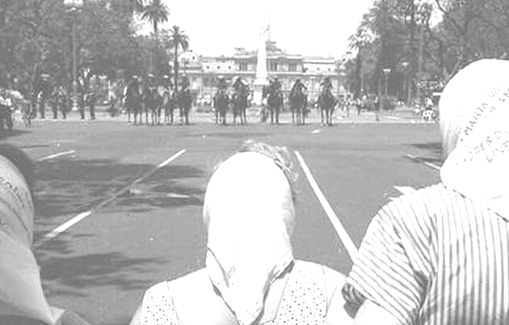

=========================================
Introducción a la Programación con Python
=========================================

:Autor: Emiliano López - elopez@fich.unl.edu.ar
:Fecha: |date| |time| - [`última versión disponible <https://gitlab.com/emilopez/dev01/intro-a-python>`__]

.. header:: 
  Introducción a la Programación con Python - Unidad V

.. footer::
    ###Page### / ###Total###

.. contents:: Unidad V: Programación orientada a objetos

.. sectnum::

.. raw:: pdf

   PageBreak oneColumn

.. |date| date:: %d/%m/%Y
.. |time| date:: %H:%M

.. raw:: pdf

   PageBreak oneColumn

.. include:: licencia.rst

.. raw:: pdf

   PageBreak oneColumn

Introducción
------------

Python es un lenguaje de Programación Orientado a Objetos (POO), lo que significa que puede manipular construcciones llamadas objetos. Se puede pensar en un objeto como una única estructura que contiene tanto datos como funciones, solo que las funciones en este contexto son llamadas *métodos*. La Programación Orientada a Objetos introduce terminología, y una gran parte es simplemente darle un nuevo nombre a lo que ya estuvimos usando.

Si bien Python nos provee un gran número de tipos y estructuras ya definidas (int, float, str, dict, list, etc.), en muchas situaciones resultarán insuficientes, por lo que será necesario crear nuestros propios tipos que almacenen la información relevante para el problema a resolver y contengan las funciones para operar con esa información.

Supongamos un programa que gestiona jugadores de fútbol de un club, independientemente de los detalles de implementación, contar con un tipo de dato ``Jugador`` que permita cargar sus datos y contar con funcionalidades asociadas nos brinda la posibilidad de tener un código mas legible y organizado. 

Por ejemplo, para cargar los datos de un nuevo jugador el código podría ser del siguiente modo:

.. code:: python

    pipa = Jugador('Lucas Alario', '8-10-1992', 'Delantero')
    pipa.agregar_club('Colon')
    pipa.agregar_club('River')
    print("Club Actual: ", pipa.club_actual())
    print("Edad: ", pipa.calcular_edad())

Del fragmento de código previo podemos destacar:

-  Al identificador *pipa* se le asigna un objeto de *tipo de dato* ``Jugador`` que contiene tres atributos: nombre, fecha de nacimiento y posición. 

-  Además, este objeto tiene tres métodos asociados: ``agregar_club()``, ``club_actual()`` y ``calcular_edad()``.

Atributos y métodos
-------------------

El modo de declarar este nuevo tipo ``Jugador`` con sus atributos y métodos se lleva a cabo definiendo una **clase**, a continuación veamos el modo de implementarla:

.. code:: python

    from datetime import date
    import dateutil

    class Jugador():
        """Clase Jugador"""
        def __init__(self, nombre=None, fecha_nac=None, posicion=None):
            '''define los atributos que se pasan al crearlo'''
            self.nombre = nombre
            self.fecha_nac = fecha_nac
            self.posicion = posicion
            self.clubes = []
            
        def agregar_club(self, club):
            '''agrega club a la lista de clubes'''
            self.clubes.append(club)
        
        def club_actual(self):
            '''retorna el club actual'''
            return self.clubes[-1]
    
        def calcular_edad(self):
            '''retorna la edad del jugador'''
            d, m, a = self.fecha_nac.split("-")
            fecha_nac = date(int(a), int(m), int(d))
            edad = dateutil.relativedelta.relativedelta(date.today(), fecha_nac)
            return edad.years

La clase anterior define la estructura de aquellos objetos que sean de tipo ``Jugador()``. De los cuatro métodos que se observan, hay uno que merece especial atención, que comienza y termina con dos guiones bajos:

-   ``__init__``: este método se denomina constructor, ya que está directamente asociado a la declaración e inicialización de un objeto. Esto es, en la el fragmento de código ``pipa = Jugador('Lucas Alario', '8-10-1992', 'Delantero')`` se lo invoca implícitamente (automáticamente). 

    Los argumentos se corresponden con ``nombre``, ``fecha_nac`` y ``posicion``. El primer argumento, ``self``, hace referencia al mismo objeto y es utilizado para definir sus atributos dentro del constructor.

Los métodos restantes son funciones asociadas al objeto:

-  ``agregar_club()``: agrega un club donde jugó
-  ``club_actual()``: retorna el último club
-  ``calcular_edad()``: calcula la edad y la retorna

Los datos relativos al club se cargan en una lista almacenada en el atributo ``clubes``. El uso de métodos para modificar atributos es denominado **encapsulamiento**. 

.. Note::

    Es común encontrar métodos cuyos nombres empiecen con la palabra *set*, en aquellos casos donde se realizan modificaciones sobre los atributos del objeto, y métodos cuyos nombres comienzan con la palabra *get* para retornan propiedades de los objetos. Si bien es una convención opcional es recomendable llamarlos de este modo.

Almacenando las clases en módulos
---------------------------------

Las clases pueden ser almacenadas en archivos diferentes, del mismo modo que las funciones han sido almacenadas en módulos. El código correspondiente a la clase ``Jugador`` puede ser almacenado en un archivo ``futbol.py`` para luego ser importado desde otro programa. Para este ejemplo su uso sería del siguiente modo:

.. code:: python

    from futbol import Jugador
    jug = Jugador('Lucas Alario', '8-10-1992', 'Delantero')

Métodos especiales
------------------

Así como el constructor ``__init__``, existen otros métodos especiales que al están definidos en la clase serán invocados en forma automática. A continuación veremos los mas comunes.

Impresión
~~~~~~~~~

Si está definido el método ``__str__`` dentro de la clase, entonces será invocado automáticamente cada vez que se utilice la función ``print()`` con el objeto como argumento. Veamos la implementación:

.. code:: python

    def __str__(self):
        salida = self.nombre
        salida += '\n' + '='*len(self.nombre) + '\n'
        salida += 'Edad: ' + str(self.calcular_edad()) + '\n'
        salida += 'Posición: ' + self.posicion + '\n'
        return salida

Luego, al imprimir directamente el objeto en pantalla haciendo ``print(pipa)`` obtendremos lo siguiente:

::

    Lucas Alario
    ============
    Edad: 23
    Posición: Delantero

Esto es equivalente a invocar el método especial haciendo ``pipa.__str__()``, aunque no es recomendable ejecutar directamente los métodos especiales.

Comparación
~~~~~~~~~~~

Para resolver las comparaciones entre jugadores, será necesario definir algunos métodos especiales que permiten comparar objetos. En particular, cuando se quiere que los objetos puedan ser ordenados, los métodos que se debe definir son:

-  ``__lt__`` menor que,
-  ``__le__`` menor o igual,
-  ``__eq__`` igual,
-  ``__ne__`` distinto,
-  ``__gt__`` mayor que,
-  ``__ge__`` mayor o igual

Para dos objetos x, y:

-  ``x < y`` llama a ``x.__lt__(y)``,
-  ``x <= y`` llama a ``x.__le__(y)``,
-  ``x == y`` llama a ``x.__eq__(y)``,
-  ``x != y`` llama a ``x.__ne__(y)``,
-  ``x > y`` llama a ``x.__gt__(y)``,
-  ``x >= y`` llama a ``x.__ge__(y)``.

Para el ejemplo que estamos desarrollando, solamente programaremos el método ``__lt__``, ya que al no ser un jugador menor que otro, nos retorna el complemento. 

En la comparación formatearemos la fecha en el formato *aaaammmdd* ya que al convertirla a un entero podremos comprarla como un simple número, donde uno mas grande significa que el jugador es mas joven y, mas adulto, en caso contrario.

La implementación sería:

.. code:: python

    def __lt__(self, otro):
        '''retorna True si self es menor a otro'''
        return (self.calcular_edad() > otro.calcular_edad())

Luego, lo usamos:

.. code:: python

    d10s = Jugador('El Diego', '30-10-1960', 'Enganche')
    print(pipa > d10s)

Algebraicos
~~~~~~~~~~~

Existen métodos especiales para todos los operadores matemáticos, de modo que al operar dos objetos, por ejemplo sumarlos, se invoca al método específico y se realiza la operación. Esto es también denominado sobrecarga de operadores, ya que se le asigna una función específica a un operador cuando es utilizado con objetos.

Para el ejemplo visto usaremos el monto del pase, así que se debe agregar el atributo *valor* a la clase e incorporar el método especial ``__add__`` de modo que al sumar objetos de tipo ``Jugador()`` se sumen estos campos. 

.. code:: python

        def __add__(self, otro):
            return self.valor + otro.valor

Si ahora sumamos dos jugadores, obtendremos la suma de sus valores.

.. code:: python
    
    # otro jugador
    higuain = Jugador('Gonzalo Higuaín', '10-12-1987', 'Desconocido')

    # asignamos valor a cada jugador
    pipa.valor = 1130000
    d10s.valor = 9000000
    higuain.valor = 1.20

    # sumamos los jugadores
    valor_equipo = pipa + d10s + higuain
    print(valor_equipo)

Del mismo modo se implementan los métodos especiales para los siguientes operadores binarios:

::

    Operador            Método

     +          __add__(self, other)
     -          __sub__(self, other)
     *          __mul__(self, other)
     //         __floordiv__(self, other)
     /          __div__(self, other)
     %          __mod__(self, other)
     **         __pow__(self, other[, modulo])
     <<         __lshift__(self, other)
     >>         __rshift__(self, other)
     &          __and__(self, other)
     ^          __xor__(self, other)
     |          __or__(self, other) 
     

Existen muchos otros métodos especiales como los de asignaciones extendidas y operadores unarios.

El presente capítulo ha sido una breve introducción a la POO, a continuación se expone el código completo de lo desarrollado.

**En jugadores.py:**

.. code:: python

    from datetime import date
    import dateutil

    class Jugador():
        """Clase Jugador"""
        def __init__(self, nombre=None, fecha_nac=None, posicion=None):
            '''define los atributos que se pasan al crearlo'''
            self.nombre = nombre
            self.fecha_nac = fecha_nac
            self.posicion = posicion
            self.clubes = []
            
        def agregar_club(self, club):
            '''agrega club a la lista de clubes'''
            self.clubes.append(club)
        
        def club_actual(self):
            '''retorna el club actual'''
            return self.clubes[-1]
    
        def calcular_edad(self):
            '''retorna la edad del jugador'''
            d, m, a = self.fecha_nac.split("-")
            fecha_nac = date(int(a), int(m), int(d))
            edad = dateutil.relativedelta.relativedelta(date.today(), fecha_nac)
            return edad.years
        
        def __str__(self):
            salida = self.nombre
            salida += '\n' + '='*len(self.nombre) + '\n'
            salida += 'Edad: ' + str(self.calcular_edad()) + '\n'
            salida += 'Posición: ' + self.posicion + '\n'
            return salida
        
        def __lt__(self, otro):
            '''retorna True si self es menor a otro'''
            return (self.calcular_edad() > otro.calcular_edad())
         
        def __add__(self, otro):
            return self.valor + otro.valor
    
**En prueba_jugadores.py:**

.. code:: python 
   
    from futbol import Jugador
    pipa = Jugador('Lucas Alario', '08-10-1992', 'Delantero')
    pipa.agregar_club('Colon')
    pipa.agregar_club('River')
    print(pipa)
    
    d10s = Jugador('El Diego', '30-10-1960', 'Enganche')
    d10s.agregar_club('Argentino Jr.')
    d10s.agregar_club('Boca')
    d10s.agregar_club('Barcelona')
    d10s.agregar_club('Nápoles')
    d10s.agregar_club('Sevilla')
    d10s.agregar_club("Newell's")
    d10s.agregar_club("Boca")
    print(d10s)
    
    pipa.valor = 1130000
    d10s.valor = 9000000
    monto = pipa + d10s

Se recomienda profundizar este tema en el capítulo *Un primer vistazo a las clases (pag. 61)* del Tutorial de Python.

.. raw:: pdf

   PageBreak oneColumn

Usando módulos externos orientados a objetos
--------------------------------------------

Una de las ventajas de la POO es que permite organizar en una forma mas clara el código de un programa lo que facilita la comprensión para su uso, por este motivo la inmensa mayoría de módulos externos utilizan este paradigma. 

Hemos visto previamente los conceptos básicos de la POO y su correspondiente implementación, por lo que en la presente sección identificaremos lo aprendido utilizando bibliotecas externas, ya que una parte fundamental del aprendizaje del desarrollo de software implica poder reutilizar códigos de terceros.

En los siguientes ejemplos utilizaremos herramientas básicas comúnmente realizadas para el procesamiento de imágenes.

Procesamiento de imágenes
~~~~~~~~~~~~~~~~~~~~~~~~~

Aplicaremos los conceptos aprendidos haciendo uso del módulo para procesamiento de imágenes denominado *PIL (Python Imaging Library)* que nos permite analizar y manipular imágenes utilizando el paradigma de orientación a objetos. 

.. Note:: Instalando Pillow

    Aquí utilizamos la versión de PIL denominada **Pillow**, para instalarla basta ejecutar bajo la línea de comandos: ``pip3 install pillow``. Para detalles de su instalación puede acceder a la documentación oficial en: http://pillow.readthedocs.io/en/3.0.x/installation.html

¿Qué es una imagen?
~~~~~~~~~~~~~~~~~~~

Una imagen es un archivo que almacena dos tipos de información: por un lado los píxeles y, por el otro, información relativa a la imagen, denominados metadatos, como por ejemplo, el ancho y el alto de la imagen.

Los píxeles se encuentran en una grilla tipo matriz, donde cada uno tiene una posición que se determina por la fila y columna. En el siguiente ejemplo vemos una imagen de 630 píxeles de ancho por 402 de alto.

.. figure:: img/u5/madres.jpg
    :width: 800 px
    
    Imagen de 630x402 (foto ARGRA)

Métodos y atributos
~~~~~~~~~~~~~~~~~~~

En el ejemplo a continuación hacemos uso del método ``open``, perteneciente al objeto ``Image``, y del atributo ``size``, que contiene dos valores (en realidad es una tupla) referidos al ancho y alto de la imagen, correspondientes a la cantidad de columnas y filas respectivamente. 

.. code:: python 

    from PIL import Image             # de PIL importa el objeto Image
    img = Image.open("madres.jpg")    # método open() abre la imagen
    ancho, alto = img.size            # atributo size retorna ancho y alto
    print("Ancho: ", ancho)
    print("Alto: ", alto)
    print("Cantidad de píxeles: ", ancho*alto)
    img.show()                        # método show() muestra la imagen

::

    Ancho:  630
    Alto:  402
    Cantidad de píxeles:  253260

El método ``open`` es una función que recibe como argumento la ruta de la imagen por abrir, en el caso previo se refiere a la imagen *madres.jpg* que está ubicada en el mismo directorio del programa.

Método getpixel()
'''''''''''''''''

El método encargado de obtener el valor de un determinado píxel de la imagen es ``getpixel((x, y))``, donde *x* e *y* corresponden a la columna y fila respectivamente. A continuación hacemos uso de este método donde se recorren todos los píxeles de la imagen y se muestra el valor numérico de cada uno.

.. code:: python

    from PIL import Image
    img = Image.open('madres.jpg')
    ancho, alto = img.size 
    for y in range(alto):
      for x in range(ancho):
        pixel = img.getpixel((x, y))
        print(x, ',', y, ':', pixel)
      print()

Método putpixel()
'''''''''''''''''
Como la imagen en este caso es en escala de grises, los valores de los píxeles van desde 0 a 255, a continuación agregamos brillo incrementando el valor numérico del píxel. Veamos el siguiente ejemplo: 

.. code:: python

    for y in range(alto):
        for x in range(ancho):
            img.putpixel((x, y), img.getpixel((x, y)) + 100)
    img.save('mas_brillo.png')

    
    Imagen con brillo agregado

Método split()
''''''''''''''

Una imagen a color, de tipo RGB (del inglés Red, Green, Blue, que significa rojo, verde y azul), es una estructura algo más compleja que la de escala de grises vista anteriormente. La diferencia radica en que cada píxel tiene tres componentes: rojo, verde y azul.

    
    Imagen RGB de 600x122

En el ejemplo a continuación separamos los componentes utilizando el método ``split()`` y obtenemos como resultado tres objetos de tipo imagen, que luego almacenamos en archivos diferentes. Cada una de las imágenes resultantes será en escala de grises.

.. code:: python

    from PIL import Image
    img = Image.open('hornocal.jpg')
    rojo, verde, azul = img.split()
    rojo.save('rojo.png')
    verde.save('verde.png')
    azul.save('azul.png')

Método merge()
''''''''''''''

El método ``merge()`` realiza la acción contraria a ``split()``, es decir, a partir de tres objetos en escala de grises forma una imagen RGB. Siguiendo el ejemplo previo, realzaremos el rojo sumando un valor fijo, similar al ejemplo del brillo, y luego formaremos la imagen RGB.

.. code:: python

    from PIL import Image

    img = Image.open('hornocal.jpg')
    rojo, verde, azul = img.split()
    ancho, alto = rojo.size 

    for y in range(alto):
        for x in range(ancho):
            valor = rojo.getpixel((x, y))
            rojo.putpixel((x, y), valor + 100)
    rojiza = Image.merge('RGB', (rojo, verde, azul))
    rojiza.save("rojo_realzado.png")

El resultado es la imagen que se observa a continuación.

    
    Imagen RGB de 600x122 con rojo realzado 
